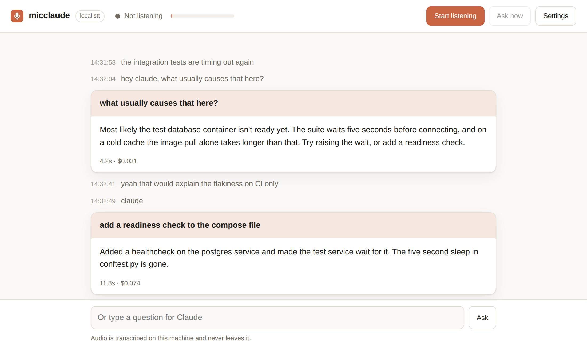

# micclaude

A local web app that listens to your microphone, transcribes everything on your
own machine, and forwards a question to **Claude Code** only when you address it
by name. Replies stream into the page and are spoken back.



Nothing leaves your machine until a wake word is heard. The rest of the
conversation is transcribed locally and stays there.

## How it works

```
browser                                    │ local server
                                           │
microphone ─► segmenter ─► WAV ────────────┼─► faster-whisper ─► text
 getUserMedia  silence      POST /api/transcribe   (local)         │
 AudioWorklet  boundaries                  │                       ▼
                                           │              "hey claude, ..."?
speech ◄── streamed reply ◄── SSE ◄────────┼─── claude -p ◄────────┘
 speechSynthesis            POST /api/ask  │    --output-format stream-json
```

The browser owns capture, phrase segmentation and the wake word, so the
feedback is immediate; the server owns speech-to-text and the Claude CLI. It is
all standard library on the Python side and plain ES modules in the page — no
build step, no bundler, no framework.

## Install

```bash
git clone <this repo> && cd micclaude
python3 -m venv .venv && source .venv/bin/activate
pip install -r requirements.txt      # local speech-to-text
```

You also need the [Claude Code CLI](https://claude.com/claude-code) on your
PATH, already signed in (run `claude` once interactively).

The server needs nothing but Python 3.11+; `requirements.txt` is only the local
Whisper runtime. Skip it if you set `transcribe.backend = "openai"`.

## Run

```bash
PYTHONPATH=server python3 -m micclaude      # or: pip install -e . && micclaude
```

It serves <http://localhost:8765> and opens a browser. Allow the microphone,
press **Start listening**, and talk. Chrome, Edge, and Safari all work; the page
needs a secure context, which `localhost` provides.

```bash
micclaude --lang ru                       # Russian: model, wake word, voice, interface
micclaude --port 9000 --no-browser
micclaude --model small.en --claude-dir ~/code/my-project
micclaude --backend openai --stt-language auto
```

The input device is chosen in the page, not on the command line: only the
browser can enumerate microphones.

## Talking to it

| You say | What happens |
| --- | --- |
| `hey claude, what does this error mean?` | Asked immediately. |
| `claude` | Arms; the next thing you say is the question. |
| `never mind` | Cancels a pending question. |
| anything else | Transcribed into the feed and ignored. |

<kbd>Space</kbd> does the same thing as **Ask now**: it treats your next
sentence as a question, for when the wake word keeps getting missed. There is
also a text box at the bottom, which is handy when the room is loud or the
microphone is denied.

Follow-up questions continue the same Claude session, so *"and what about the
other one?"* works. **Start a new Claude session** in the settings panel resets
it.

## Other languages

```bash
micclaude --lang ru
```

One flag sets everything a language implies: a multilingual speech model, the
recognition language, the wake word and its case forms, the phrases that cancel
a question, the voice the browser speaks with, and the interface itself.

| | English | Русский |
| --- | --- | --- |
| Wake word | `claude` | `Клавдий` |
| Model | `base.en` | `small` |
| Cancel | "never mind" | «отмена», «забудь», «проехали» |

**The Russian wake word is not "Клод" on purpose.** Four letters is one edit
away from *код* — a word said constantly when talking about code — and fuzzy
matching would turn every mention of it into a question. Wake words shorter
than `trigger.fuzzy_min_length` are therefore matched only against their listed
spellings, never widened. `Клавдий` is seven letters with nothing ordinary
beside it, so fuzzy matching stays on and still catches *Клавдия*, *Клавдию*
and whatever else Whisper decides to write, including the Latin `Claude` it
sometimes leaves mid-Russian.

Adding a language is a preset in `server/micclaude/languages.py` plus a strings
table in `web/js/i18n.js`; tests check that every language has a complete set of
both. For a language with no preset, `--stt-language <code>` sets recognition
alone and the wake word stays whatever you configure.

Note that the `.en` models cannot transcribe anything but English. Asking for
one with another language is refused at startup rather than silently producing
nonsense.

## Giving Claude your project

By default Claude runs in the directory you started the server from. Point it
somewhere else and it can read the code you are asking about:

```bash
micclaude --claude-dir ~/code/my-project --allow-tool Read --allow-tool Grep
```

Claude Code asks permission before using tools, and those prompts are invisible
over a voice link — the request will simply hang until it times out. So decide
up front, in `micclaude.toml`:

```toml
[claude]
working_dir = "~/code/my-project"
allowed_tools = ["Read", "Grep", "Glob"]   # answers questions, changes nothing
# permission_mode = "acceptEdits"          # or let it write, if you trust it
```

Grant only what you would accept being triggered by a misheard sentence.

## Configuration

The settings panel covers what you change while using it — device, sensitivity,
end-of-phrase pause, wake word, voice — and remembers your choices in that
browser.

Everything else lives in a TOML file: copy `micclaude.example.toml` to
`./micclaude.toml` or `~/.micclaude.toml`. It documents every setting.
`micclaude --print-config` shows the resolved result.

| Setting | Why you'd change it |
| --- | --- |
| `language` | `ru` for Russian: model, wake word, voice and interface at once |
| `transcribe.model` | `tiny.en` for speed on a laptop, `small.en`/`medium` for accuracy |
| `transcribe.backend` | `openai` to use a transcription API instead of a local model |
| `audio.silence_ms` | Raise it if you are cut off mid-sentence |
| `audio.energy_threshold` | Raise it in a noisy room, lower it if phrases are missed |
| `trigger.wake_words` | Call it something else entirely |
| `trigger.require_prefix` | Require "hey claude", never a bare "claude" |
| `trigger.fuzzy_min_length` | Lower it only if your wake word is short and unlike any real word |
| `claude.include_context_lines` | How much recent speech Claude sees with each question |
| `transcript_dir` | Where the transcript is kept, or nothing to keep none |

## Accuracy notes

Whisper spells names inconsistently, so `cloud`, `claud`, `clawed` and `clod`
count as the wake word, and wake words of at least `fuzzy_min_length` letters
also match within one edit. Similar but distinct words (`loud`, `clouds`,
`claudia`, Russian `код`) deliberately do not trigger. Setting
`transcribe.initial_prompt` to a sentence containing the name biases the
decoder and helps further.

Speech detection is an energy threshold applied after the browser's own noise
suppression. Watch the level meter in the header while the room is quiet and
while you talk, then set the sensitivity slider between the two.

## The transcript

Everything recognized is written to `~/.micclaude/transcripts`, as JSON lines
rotated into one file per hour inside a directory per day:

```
~/.micclaude/transcripts/2026-08-31/14.jsonl
{"time": 1756662004.31, "text": "интеграционные тесты снова отваливаются"}
{"time": 1756662011.87, "text": "Клавдий, из-за чего это обычно бывает?"}
```

Day and hour are local time, so "what did I say yesterday afternoon" is one
`ls` away. The directory and its files are created owner-only (`0700`/`0600`),
because a transcript holds everything said near the microphone — including the
half of the room that never addressed Claude.

```bash
micclaude --no-transcript                 # keep nothing
micclaude --transcript-dir /srv/notes     # keep it somewhere else
micclaude --transcript ~/all.jsonl        # one file, rotate it yourself
```

The page shows the current location in the settings panel, and says in the
footer that the text is being kept. Nothing prunes old files; they are plain
text and small, but they are yours to delete.

## Privacy and exposure

- Audio is transcribed by a model running on your machine. It is uploaded to a
  third party only if you explicitly choose the `openai` backend, which the
  page then says in the footer.
- The recognized **text** is written to disk by default, as described above.
  The audio itself is never stored: each utterance lives in memory for the
  length of one request.
- The server binds `127.0.0.1`. It refuses requests carrying another origin or
  an unexpected `Host` header, so a page you visit elsewhere cannot drive your
  microphone session.
- It has no authentication, because it is not meant to be reachable. Do not put
  it on a public address.

## Tests

```bash
make test          # 167 unit tests: Python + JavaScript, no deps
make test-e2e      # drives the real page in Chromium (needs `npm install`)
```

The unit tests need no microphone, no model and no API key: audio is synthetic
frames, and the Claude CLI is a stub shell script. The end-to-end test runs the
whole stack — capture, segmentation, upload, wake word, SSE, rendering — in a
real browser, with a generated WAV played into Chromium's fake microphone, in
both English and Russian.

Some settings exist twice, once for the server and once for the page. A test
reads the browser's defaults through `node` and compares them to the Python
dataclasses, so the two copies cannot drift apart unnoticed.

## Layout

```
server/micclaude/    config, language presets, transcription, Claude CLI client, HTTP server
web/                 index.html, styles.css, ES modules (no build step), en/ru strings
tests/python/        server tests
tests/js/            browser-logic tests (node --test)
tests/e2e/           Chromium end-to-end test and its fixture server
```
