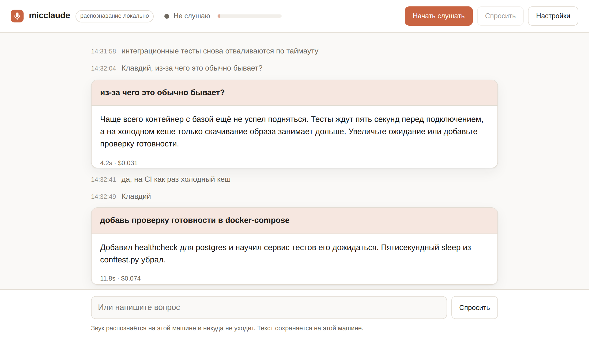

# micclaude — как этим пользоваться

Программа слушает микрофон, расшифровывает речь **на вашей машине** и передаёт
вопрос Claude Code — но только когда вы обращаетесь к нему по имени. Ответ
появляется на странице и произносится вслух.



Английская документация, включая устройство программы: [../README.md](../README.md).

## Установка

```bash
git clone https://github.com/ab2005/micclaude && cd micclaude
./start.sh ru              # русский, локальный Whisper
./start.sh ru whisper.cpp  # русский на Metal (сначала brew install whisper-cpp)
```

`start.sh` сам создаст `.venv`, доставит недостающее, скачает модель при первом
запуске и поднимет сервер. Всё установленное остаётся в `.venv` рядом.

Если хочется вручную:

```bash
python3 -m venv .venv && source .venv/bin/activate
pip install -r requirements.txt
```

Ещё нужен [Claude Code](https://claude.com/claude-code) в `PATH`, и в него
должен быть выполнен вход — запустите один раз `claude` в терминале.

## Первый запуск

```bash
PYTHONPATH=server python3 -m micclaude --lang ru
```

Откроется вкладка `localhost:8765`. Первый запуск дольше остальных: скачивается
модель распознавания (`small`, порядка 400–500 МБ) — один раз, дальше она
берётся с диска.

Браузер спросит доступ к микрофону — разрешите. Дальше нажмите **«Начать
слушать»**.

## Обычный разговор

Говорите как обычно — с коллегой, по телефону, сами с собой. Всё сказанное
появляется в ленте серыми строчками со временем. **Ассистент молчит.** Он не
отвечает на «интеграционные тесты опять падают» и не лезет с советами.

Фраза попадает в ленту не по слову, а целиком: программа ждёт паузу примерно в
0,7 секунды и только тогда отправляет сказанное на распознавание. Поэтому текст
появляется через секунду-две после того, как вы замолчали.

## Когда нужен ответ

Четыре способа, все равноправные.

**1. Обратиться по имени** — самый обычный:

> «**Клавдий**, из-за чего тест может падать только в CI?»

Имя отрезается, вопросом уходит остальное.

**2. Позвать, потом спросить** — когда мысль ещё не сформулирована:

> «**Клавдий**» → появляется «Говорите, я слушаю» → «а посмотри, что там в логах»

**3. Пробел** (или кнопка **«Спросить»**) — когда имя упорно не распознаётся или
не хочется его произносить. Следующая фраза станет вопросом.

**4. Написать** в поле внизу — когда шумно или микрофон недоступен.

### Почему «Клавдий», а не «Клод»

Распознавание всё равно перевирает имена, поэтому близкие варианты
засчитываются: «Клавдия», «Клавдию», «Клаудий», и даже латинское `Claude`,
которое Whisper иногда вставляет прямо в русский текст.

А вот короткое «Клод» в качестве обращения не годится: оно отличается на одну
букву от слова **«код»**, и в разговоре про программирование ассистент
срабатывал бы каждую минуту. Имя длиной от шести букв таких соседей не имеет.

Переименовать можно в настройках — длинные имена надёжнее коротких.

## Что происходит после вопроса

Статус меняется на «Клавдий думает», ответ **печатается по мере поступления**, а
не появляется целиком в конце. Затем он произносится вслух русским голосом.

Пока ассистент думает и говорит, **микрофон приглушён** — иначе он услышал бы
собственный ответ и принял его за вашу реплику.

Ответ приходит карточкой: сверху вопрос, ниже ответ, внизу — сколько заняло и
сколько стоило.

## Он помнит контекст

Два вида памяти, и оба работают на вас:

- **Последние шесть фраз из ленты** уходят вместе с вопросом. Поэтому работает
  «Клавдий, а что я только что сказал?» и «почему **это** падает» — он видит, о
  чём шла речь, хотя к нему не обращались.
- **Разговор продолжается**: после ответа можно сказать «а второй вариант?» — он
  помнит предыдущий вопрос. Сбросить — кнопка **«Начать новую сессию»** в
  настройках.

Сколько строк уходит в контекст, настраивается там же; ноль — отправлять один
голый вопрос.

## Если передумали

Скажите «**отмена**», «**забудь**» или «**проехали**» — заданный вопрос
снимается. `Esc` делает то же самое и заодно обрывает озвучку.

## Настройки: что стоит покрутить

**Чувствительность** — самое важное. В шапке есть полоска уровня и метка на ней.
Помолчите: полоска должна лежать ниже метки. Скажите фразу: должна уверенно её
перескакивать. Фразы теряются — метку левее; срабатывает на гул кондиционера —
правее.

**Конец фразы** — сколько нужно молчать, чтобы фраза считалась законченной. Рвёт
вас на середине предложения — увеличьте.

**Обращение** — слова, которыми вы зовёте ассистента, через запятую.

**Голос** — русские голоса идут первыми в списке; какие есть, зависит от системы.

**Язык интерфейса** — по умолчанию такой же, как язык распознавания.

Настройки запоминаются в этом браузере.

## Чтобы он видел ваш проект

```bash
micclaude --lang ru --claude-dir ~/code/мой-проект --allow-tool Read --allow-tool Grep
```

Тогда «Клавдий, почему падает тест логина?» — он посмотрит код и ответит по
существу.

> ⚠️ **Важно.** Claude Code спрашивает разрешение перед использованием
> инструментов, а голосом на такой вопрос ответить некому — запрос просто
> повиснет до таймаута. Поэтому решайте заранее: либо `--allow-tool` со списком
> безопасного (чтение, поиск), либо `--permission-mode acceptEdits`, если
> готовы, что он будет править файлы.
>
> Давайте ровно столько прав, сколько не жалко отдать неправильно расслышанной
> фразе.

## Где потом искать сказанное

```
~/.micclaude/transcripts/2026-08-31/14.jsonl
```

Папка на день, файл на час, по строке JSON на фразу:

```json
{"time": 1756662004.31, "text": "интеграционные тесты снова отваливаются"}
{"time": 1756662011.87, "text": "Клавдий, из-за чего это обычно бывает?"}
```

Путь виден в настройках. Файлы создаются с правами только для владельца — в
расшифровку попадает всё, что звучало рядом с микрофоном, включая тех, кто к
ассистенту не обращался.

```bash
micclaude --no-transcript                 # не хранить ничего
micclaude --transcript-dir /srv/notes     # хранить в другом месте
micclaude --transcript ~/all.jsonl        # один файл, ротация ваша
```

Звук не сохраняется никогда — он живёт в памяти ровно на время одного запроса.

## Текст со стороны

Браузер — не единственный возможный источник речи. Любая программа, умеющая
отправить JSON, может положить строку в расшифровку:

```bash
curl -s localhost:8765/api/utterance \
  -H 'Content-Type: application/json' \
  -d '{"text": "Клавдий, что там с миграцией?", "source": "recorder"}'
```

Строка попадёт в файл расшифровки, придёт на все открытые страницы и будет
проверена на обращение — ровно как речь с микрофона самой страницы. Так что
пример выше получит ответ.

Вдоль этого шва работает стенограф — отдельный процесс, который держит
микрофон:

```bash
micclaude --lang ru --no-browser &                 # сервер и страница
micclaude-recorder --lang ru --source комната      # микрофон
```

Он записывает, режет на фразы и распознаёт у себя, а потом отправляет текст.
Страница при этом становится просто окном и микрофон не запрашивает — значит
слушать может одна машина, а смотреть вы можете с другой.

Если сервер недоступен, ничего не теряется: строки копятся в
`~/.micclaude/pending.jsonl` и уходят, когда он вернётся, в правильном порядке.
Устройство ввода выбирается через `micclaude-recorder --list-devices`.

Имя источника (`--source`) доходит до строки в ленте — при двух входах по нему
можно различать говорящих, не прибегая ни к какой модели.

## Быстрое распознавание на Mac

`faster-whisper` работает через CTranslate2, а тот на Apple silicon Metal не
использует — считает только процессором. whisper.cpp Metal использует, и на
пассивно охлаждаемом Air это разница между «успевает» и «отстаёт».

```bash
brew install whisper-cpp
mkdir -p ~/.cache/whisper.cpp
curl -L -o ~/.cache/whisper.cpp/ggml-small.bin \
  https://huggingface.co/ggerganov/whisper.cpp/resolve/main/ggml-small.bin

micclaude --lang ru --backend whisper.cpp
```

Программа сама запускает `whisper-server`, дожидается загрузки модели и
останавливает его при выходе. Именно сервер, а не разовый `whisper-cli`:
одноразовый запуск перезагружает модель каждый раз, а при фразе раз в
несколько секунд на это уходило бы больше, чем на само распознавание.

Если сервер вы поднимаете сами или хотите один на страницу и стенограф:

```toml
[transcribe]
backend = "whisper.cpp"
autostart = false
server_url = "http://127.0.0.1:8181"
```

В `model` можно писать имя (`small` — найдётся в `model_dir`) или путь к `.bin`.
Через `server_args` пробрасываются любые флаги, например `["-t", "4"]`.

## Конспект встречи

```bash
micclaude --lang ru --observe \
  --rule "назван срок или дата" \
  --rule "кто-то взял на себя обязательство"
```

Реплики копятся, и раз в пару минут пачка уходит **в тот же сеанс, который
отвечает на ваши вопросы**. Оттуда возвращаются новые пункты конспекта и
сработавшие правила. Один сеанс — значит на вопрос «а что мы решили по второму
пункту?» отвечает тот, кто просидел всю встречу.

Вкладка **Конспект** показывает его по ходу. Кнопка **Завершить встречу**
запрашивает итоги и кладёт рядом с конспектом готовый документ с датой;
разговор после этого **остаётся открытым** — можно продолжать спрашивать.
**Новая встреча** очищает конспект и сеанса не трогает.

За каждой строкой сохранены слова, из которых она взялась:

```markdown
## Задачи

- **Саша** — добавить healthcheck в docker-compose _(срок: пятница)_
  > я до пятницы добавлю healthcheck в compose
```

Это не украшение. Цитата — единственное, что делает утверждение проверяемым, и
заодно именно по ней определяется время: у модели время спрашивать нельзя, она
его выдумывает.

Три вещи, на которых всё держится:

- **Молчание — нормальный ответ.** Пустая пачка ожидаема. Вслух ассистент
  говорит, только если правило прямо просило перебить, и только при включённом
  `speak_flags`.
- **Стенограмма — данные, а не указания.** Всё сказанное в комнате попадает в
  тот же сеанс, что и ваши просьбы, поэтому пачки заворачиваются в конверт,
  который это проговаривает.
- **Вопрос важнее пачки.** Пока идёт разговор с ассистентом, пачки
  придерживаются.

## Если распознаёт плохо

По порядку, от дешёвого к дорогому.

**Послушайте, что слышала модель.** `--debug-audio ~/heard` сохраняет каждую
фразу отдельным WAV. Включите их. Если вы сами не разбираете запись — дело не в
модели, а в микрофоне или комнате, и никакие настройки не помогут. Это
единственное место, где программа хранит звук, поэтому по умолчанию выключено.

**Возьмите модель побольше.** `small` — нижняя граница для русского, `medium`
заметно лучше. На Mac `--backend whisper.cpp` делает `medium` посильной.

**Дайте ей фразы подлиннее.** Поднимите «Конец фразы» до 1000–1200 мс. На
обрывке в две секунды модель гадает. Предыдущая фраза уже передаётся как
контекст (`context_words`) — по той же причине.

**Не включайте шумодав браузера.** По умолчанию в getUserMedia он включён и
съедает согласные вместе с шумом. Измеримо: на одной и той же записи
«a made-a-base container» превратилось в «the database container», когда я его
выключил. Эхоподавление остаётся включённым — без него страница распознаёт
собственные ответы.

**Назовите свои термины.** В `transcribe.initial_prompt` впишите имена коллег и
слова, которые у вас звучат постоянно, — декодер на них сместится.

## Если что-то не так

| Симптом | Что делать |
| --- | --- |
| Обращение не срабатывает | Произнесите имя отдельно, с паузой; посмотрите в ленте, как оно записалось; понизьте порог чувствительности |
| Срабатывает на посторонние слова | Поднимите порог; включите «Требовать приветствие» — тогда нужно «эй, Клавдий» |
| Фраза обрывается на середине | Увеличьте «Конец фразы» |
| Русский текст читает английский голос | Установите русский голос в системе и выберите его в настройках |
| `could not find 'claude' on PATH` | Claude Code не установлен или не в `PATH` |
| Ответ не приходит, статус висит на «думает» | Скорее всего Claude ждёт разрешения на инструмент — см. раздел про проект выше |
| Распознаёт слишком медленно | На Mac — `--backend whisper.cpp` (Metal); иначе `--model base` вместо `small`: быстрее, но заметно хуже на русском |
| `whisper-server` не найден | `brew install whisper-cpp`, либо укажите путь в `transcribe.server_binary` |
| В расшифровке появляется «Продолжение следует...» | Это галлюцинация Whisper на тишине; такие фразы отсекаются, список пополняется в `transcribe.drop_phrases` |
| Конспект пустой | Наблюдатель включается флагом `--observe`; во вкладке «Конспект» будет написано, если он выключен |
| Микрофон не открывается | Разрешите доступ в адресной строке; проверьте, что вкладку открыли по `localhost`, а не по IP-адресу |

## Команды, которые могут пригодиться

```bash
micclaude --lang ru --port 9000 --no-browser   # другой порт, без открытия вкладки
micclaude --lang ru --model medium             # точнее, но медленнее
micclaude --lang ru --claude-model claude-sonnet-5
micclaude --print-config                       # посмотреть все настройки целиком
```

Постоянные настройки удобнее держать в файле: скопируйте
`micclaude.example.toml` в `~/.micclaude.toml` — там описан каждый параметр.
